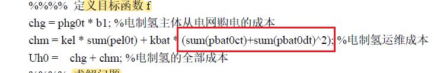
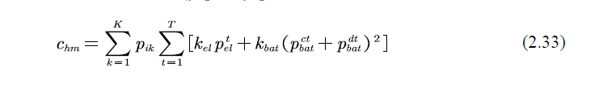

# 日志
用于记录遇到的问题，以及解决方案，方便自己后续进行回顾或者以后别人再遇到问题可以看看

## 文件夹当前架构
### 4.26
在copy_scr文件夹里面新建了initialization.m和scene_reduction.m和init_plot.m三个文件，作用分别是生成随机风光氢场景、缩减场景以及调用函数并且画图

## 4.26遇到问题以及解决方案
1. 首先就是尝试同步到git和github，结果发现代理配置不对，先使用了以下命令得到当前端口，发现还是之前使用的，于是准备进行修改。
    ~~~
    git config --global --get http.proxy                
    git config --global --get https.proxy
    ~~~
    使用以下命令进行修改配置端口
    ~~~
    git config --global http.proxy http://127.0.0.1:7897
    git config --global https.proxy https://127.0.0.1:7897
    ~~~
    但是还是存在报错，后来查看了配置的详细页
    ~~~
    git config --show-origin --get-regexp proxy
    ~~~
    发现之前单独对于GitHub建立了一个配置，删去即可
2. 师兄的命名有点乱，特别是到氢负荷那一块，感觉是后来再添加的部分，进行了一下修改
    ~~~
    P_data --- P_wind_pre
    H_data --- H2_data
    a_h = a_pv2
    %% 类似这种，主要出现在氢负荷部分
    ~~~

## 4.27遇到问题以及解决方案
1. 重新整理了一下绘图部分的代码，放在一块我真的有点看不懂，对matlab的绘图代码还是不了解
2. 想着改变量名的，但是太复杂了，之后再说吧
3. 这里的平方项应该错了吧，应该在外面
    
    
4. 出现报错如下，发现是因为yalmip不能在约束环境外面对sdpvar进行直接赋值，需要在约束当中进行赋值，后续进行修改，把初始状态和更新状态放进约束里面，警告消失，但是感觉可读性会差一点。
    ~~~
    警告: One of the constraints evaluates to a DOUBLE variable 
    > 位置：constraint/horzcat (第 6 行) 
    位置: H_model (第 68 行) 
    位置: run (第 112 行) 
    位置: main_noncoop (第 10 行)
    ~~~
5. 发现电制氢的最小成本应该是正值，一开始给了一个负号，后面进行修改。
6. 赋值优化结果的时候，在风电和光伏的部分有两行利润的计算，实际上是理想最大利润，也就是全部风电和光电都卖给电网的利润，电制氢不参与的情况。
7. 